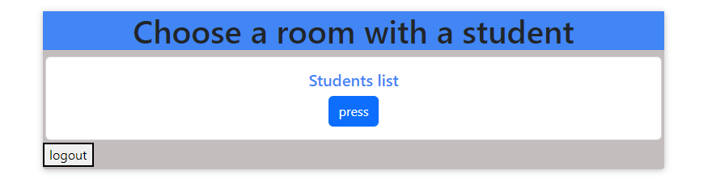
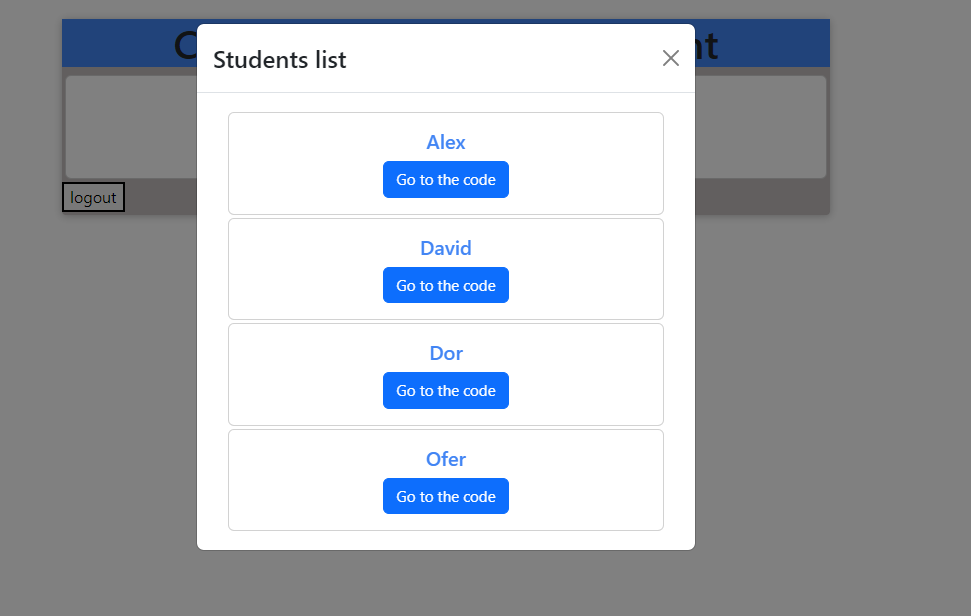
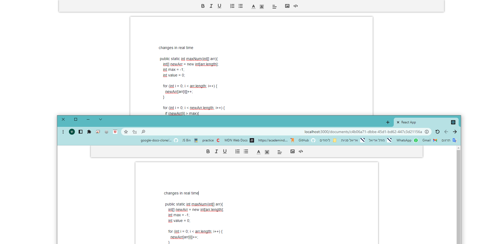

# Coding App

> This site gives the option of sharing code live with several participants in the room.

https://client-code.onrender.com

#### <ins>Using</ins>

- <ins>Front:</ins>
  - React
  - Bootstrap
  - Quill
      
- <ins>Back:</ins>
  - Firebase
  - nodemon
      

* Socket.io

  

## **1. Login page**

  

## **2. Course list page**

  

## **2. Student list page**

  

## **3. Chat-room page (on live)**

    

> NOTE: ALL RIGHTS RESERVED TO Shir Feldman
