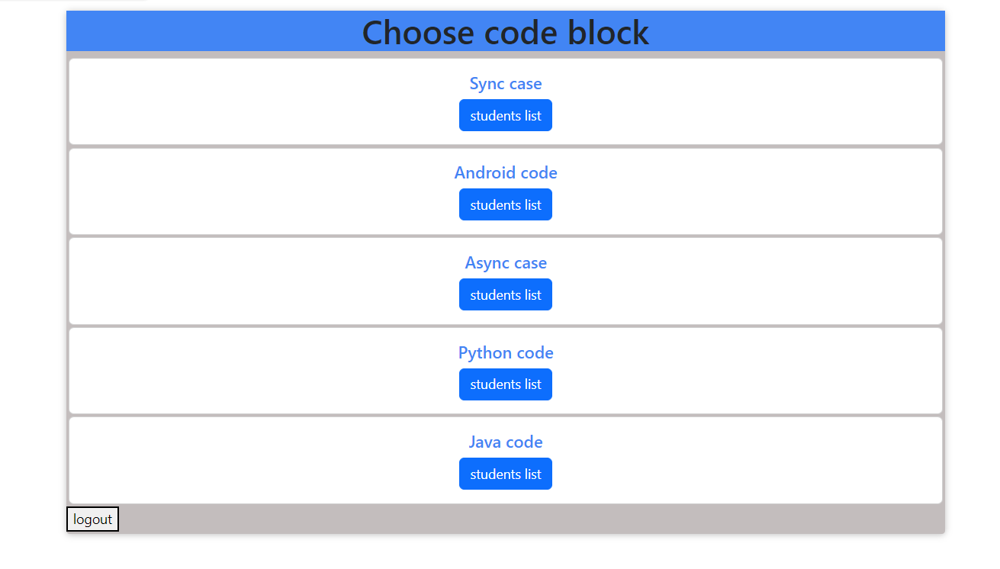
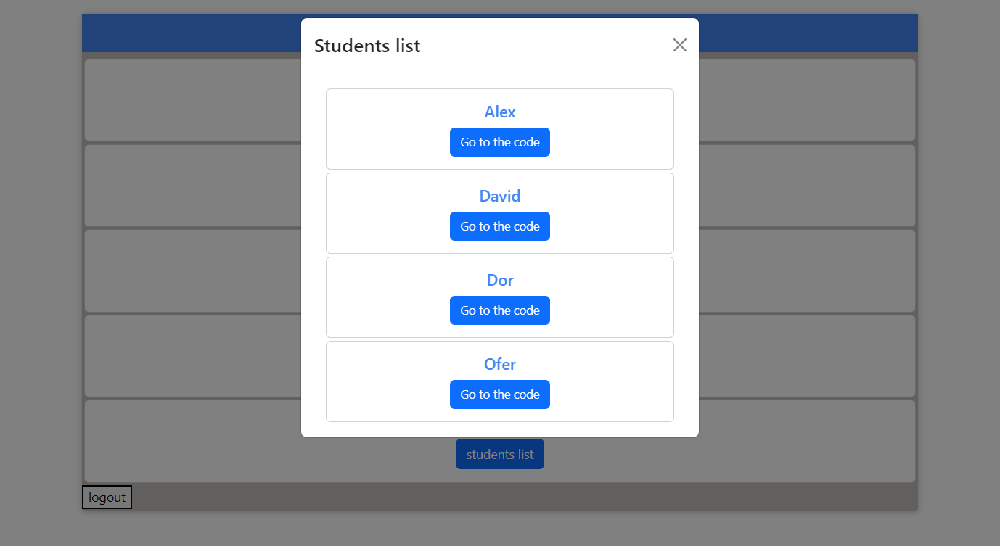
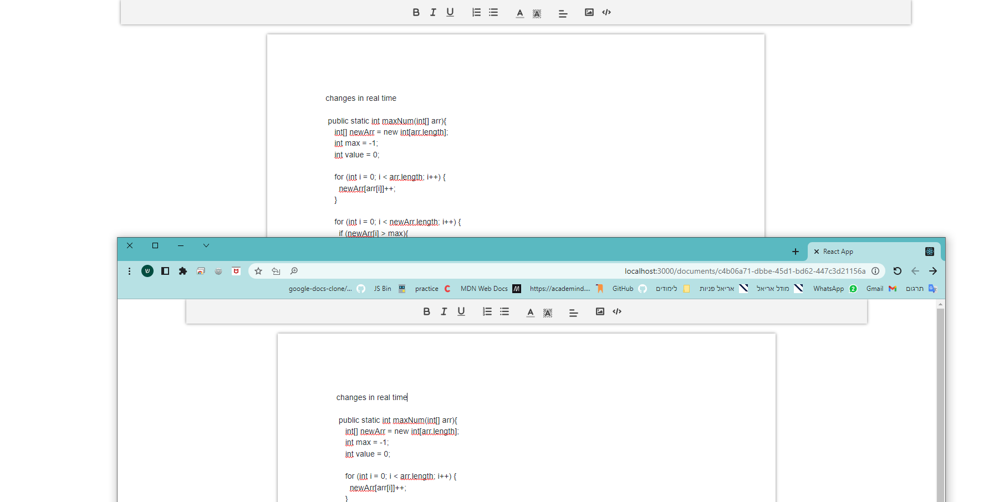

# Coding App

> NOTE: ALL RIGHTS RESERVED TO Shir Feldman

#### <ins>Using</ins>

- <ins>Front:</ins>
  - React
  - Bootstrap
  - Quill
      
- <ins>Back:</ins>
  - Firebase
  - nodemon
      

* Socket.io

  

## **1. Login page**

  

## **2. Course list page**

  

## **2. Student list page**

  

## **3. Chat-room page**

    

<video width="500" height="240" controls>
  <source src="./pics/video.mp4" type="video/mp4">

Your browser does not support the video tag.
</video>